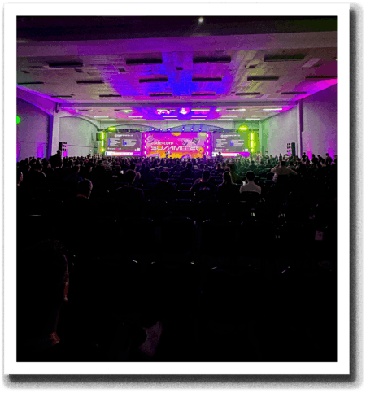

#### 👨🏻‍💻 I'm Weslley and I've been working on _open-source_ since **2021**.

> **Speaker** | **2x Microsoft MVP** | **Anthropic CVP**

---

🐷 I've been working on [**Poku**](https://github.com/wellwelwel/poku?tab=readme-ov-file#readme), an innovative test runner. 
🪼 I founded [**Lagune**](https://github.com/wellwelwel/lagune?tab=readme-ov-file#readme), your security copilot through AI.

> **Give them a **star** to show your support ★**

 

#### 🤝 Featured projects I maintain

<table>
  <tbody>
    <tr>
      <td width="165"><a href="https://github.com/sidorares/node-mysql2/pulls?q=is:merged+author:wellwelwel">MySQL2</a></td>
      <td width="117"></td>
      <td>⚡️ Fast <b>mysqljs/mysql</b> compatible <b>MySQL</b> driver for <b>Node.js</b>.</td>
    </tr>
    <tr>
      <td><a href="https://github.com/mysqljs/named-placeholders/pulls?q=is:merged+author:wellwelwel">named-placeholders</a></td>
      <td></td>
      <td>🐬 PDO-style SQL named placeholders to unnamed compiler.</td>
    </tr>
    <tr>
      <td><a href="https://github.com/wellwelwel/lru.min/pulls?q=is:merged+author:wellwelwel">lru.min</a></td>
      <td></td>
      <td>🔥 An extremely fast and efficient <b>LRU</b> <i>in-memory</i> cache for <b>JavaScript</b>.</td>
    </tr>
    <tr>
      <td><a href="https://github.com/mysqljs/aws-ssl-profiles/pulls?q=is:merged+author:wellwelwel">AWS SSL Profiles</a></td>
      <td></td>
      <td>📜 AWS RDS SSL certificates bundles <i>(created under <a href="https://github.com/mysqljs">mysqljs</a> organization)</i>.</td>
    </tr>
    <tr>
      <td><a href="https://github.com/mysqljs/sql-escaper/pulls?q=is:merged+author:wellwelwel">SQL Escaper</a></td>
      <td></td>
      <td>🛡️ Faster AST-based SQL escape and format <i>(created under <a href="https://github.com/mysqljs">mysqljs</a> organization)</i>.</td>
    </tr>
    <tr>
      <td><a href="https://github.com/wellwelwel/poku/pulls?q=is:merged+author:wellwelwel">Poku</a></td>
      <td></td>
      <td>🐷 A <i>multi-runtime</i> test runner that <a href="https://poku.io/docs/philosophy#javascript-essence-for-tests-">brings the <b>JavaScript</b> essence back to testing</a>.</td>
    </tr>
  </tbody>
</table>

---

#### 🎉 Sponsors

Really thanks <strong>to everyone</strong> who has supported and keeps supporting my work.

---

› [**Contact me**](https://weslley.io/?partners) for talks, workshops, or collaborations 🎙️
